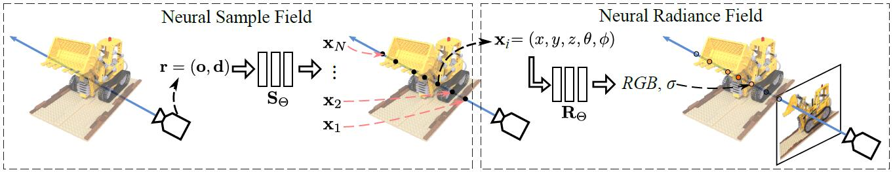

# NeuSample: Neural Sample Field

### [Project Page](https://jaminfong.cn/neusample/) | [Paper](https://arxiv.org/abs/2111.15552)

[NeuSample: Neural Sample Field for Efficient View Synthesis](https://arxiv.org/abs/2111.15552)   
[Jiemin Fang](https://jaminfong.cn/)<sup>1</sup>, [Lingxi Xie](http://lingxixie.com/)<sup>2</sup>, [Xinggang Wang](https://xinggangw.info/)<sup>✉1</sup>, [Xiaopeng Zhang](https://sites.google.com/site/zxphistory/)<sup>2</sup>, [Wenyu Liu](http://eic.hust.edu.cn/professor/liuwenyu/)<sup>1</sup>, [Qi Tian](https://scholar.google.com/citations?hl=en&user=61b6eYkAAAAJ)<sup>2</sup>  
<sup>1</sup> HUST, <sup>2</sup> Huawei Cloud

-----------------------------

Neural radiance fields (NeRF) have shown great potentials in representing 3D scenes and synthesizing novel views, but the computational overhead of NeRF at the inference stage is still heavy. To alleviate the burden, we delve into the coarse-to-fine, hierarchical sampling procedure of NeRF and point out that the coarse stage can be replaced by a lightweight module which we name a neural sample field. The proposed sample field maps rays into sample distributions, which can be transformed into point coordinates and fed into radiance fields for volume rendering. The overall framework is named as NeuSample. We perform experiments on Realistic Synthetic 360° and Real Forward-Facing, two popular 3D scene sets, and show that NeuSample achieves better rendering quality than NeRF while enjoying a faster inference speed. NeuSample is further compressed with a proposed sample field extraction method towards a better trade-off between quality and speed.

## Noting
* *Oct. 2022* - A preliminary version of code is released.
* Code will be released here in the future.

## Citation
If you find this project helpful in your research, welcome to cite the paper.
```
@article{fang2021neusample,
  title={NeuSample: Neural Sample Field for Efficient View Synthesis},
  author={Jiemin Fang and Lingxi Xie and Xinggang Wang and Xiaopeng Zhang and Wenyu Liu and Qi Tian},
  journal={arXiv:2111.15552},
  year={2021}
}
```
